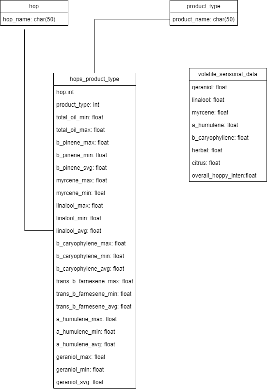
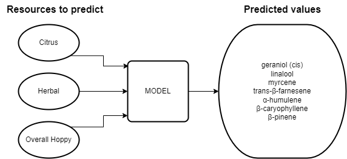

# Hops-predictor

## Table of Contents
1. [Description](#Description)
2. [System Architecture](#System)
3. [Database](#Database)
4. [Model Trainning](#Model)
5. [Examples](#Examples)
6. [Dependencies](#dependencies)

## Description
The project focuses on developing an artificial intelligence (AI) tool for predicting hop aromas in beers. Currently, there are around 120 beer styles and 250 hop varieties, for this reasons, the vast array of beer styles and hop varieties available in the market, brewers and enthusiasts often seek ways to understand and anticipate the sensory experience provided by different hop choices.

By leveraging machine learning algorithms and data obtained from academic article references, this tool offers a practical solution to predict the sensory attributes of various hop varieties. It enables users to explore and identify the potential aromas associated with specific hops: The developed tool has the capability to predict 3 sensory attributes of 81 different hop varieties

## System Architecture

This document provides an overview of the system architecture for the application, which is divided into three main components: **Database**, **API**, and **Web Application**. It outlines the high-level design and interactions between these components.

## Database
### Dataset
Like in almost all artificial intelligence models, data scarcity was one of the main challenges. Our data was collected from over 80 scientific articles, which provided some achievable predictions through certain parameters for populating our database. Almost all of this data is used for training our artificial intelligence, which will utilize the same data for future predictions.
### Diagram

## Model Trainning

The training data is extracted from a database. These data were collected in specialized laboratories. Due to the scarcity of data and the difficulty in finding them, our training model uses the fields 'citrus', 'herbal (herbaceous)', and 'overall hoppy intensity' as input parameters from the dataset and generates predictions for the fields 'geraniol (cis)', 'linalool', 'myrcene', 'trans-β-farnesene', 'α-humulene', 'β-caryophyllene', and 'β-pinene' in the dataframe. For the training of the model, we use 80% of the data for training and 20% for testing to ensure the quality of the training.

The training for this data was performed using Linear Regression, which is the ideal technique for modeling dependent variables with one or more independent variables. By using Linear Regression, we aim to minimize the difference between the predicted and actual values. The functionalities used in our Python program were from the Sklearn library (Scikit-learn), which provides various machine learning algorithms and tools for data analysis and modeling. For more informations about Linear regression and the Python function used: [Linear Regression](https://www.analyticsvidhya.com/blog/2021/10/everything-you-need-to-know-about-linear-regression/) and 
[Sklearn: MultiOutputRegressor](https://scikit-learn.org/stable/modules/generated/sklearn.multioutput.MultiOutputRegressor.html)

## Examples

## Dependencies
1. pandas
2. numpy

